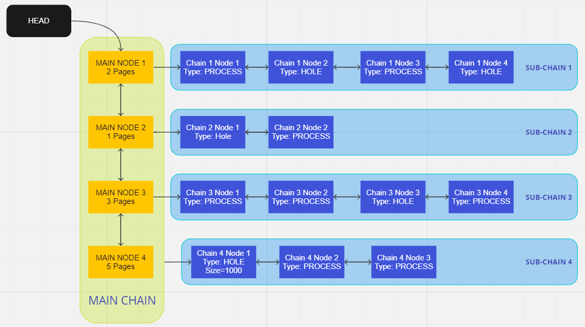
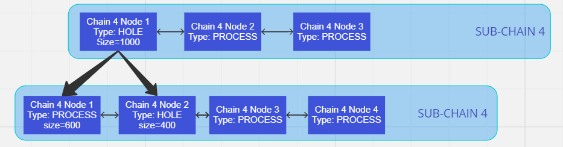
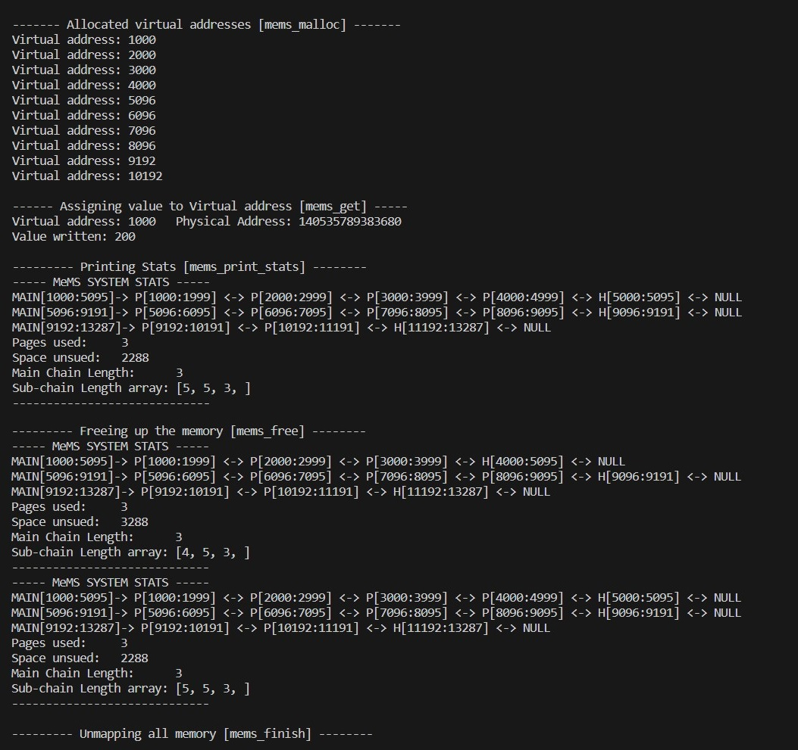

# MeMS: Memory Management System

## Overview

MeMS is a custom memory management system designed to efficiently allocate and track memory for a single process. It utilizes a free list, represented as a doubly linked list (main chain), to manage memory segments.

## Features

### Main Chain
- Represents the free list using a doubly linked list.
- Each node in the main chain corresponds to a memory allocation request from the OS (using `mmap`).
- Each node points to a sub-chain.

### Sub-Chain
- Each node in the sub-chain represents a segment of memory.
- Segments are either of type `PROCESS` (mapped to the user program) or `HOLE` (available for allocation).
- When a user program requests memory, MeMS searches for a sufficiently large `HOLE` segment in any sub-chain.
- If no suitable `HOLE` is found, MeMS requests more memory from the OS and adds a new node to the main chain.

## Memory Allocation
- **User Request Handling**: MeMS first tries to allocate memory from existing `HOLE` segments. If successful, the `HOLE` segment is marked as `PROCESS`. If the allocated size is smaller than the `HOLE`, the remaining part becomes a new `HOLE` segment.
- **OS Request Handling**: If no suitable `HOLE` is found, MeMS requests additional memory from the OS using `mmap`.

## Address Mapping

### MeMS Virtual and Physical Address
- **MeMS Physical Address**: The address returned by `mmap`, treated as a physical address within MeMS.
- **MeMS Virtual Address**: The address returned by `mems_malloc`, used by the user process within MeMS.
- MeMS maintains a mapping between MeMS virtual and physical addresses, similar to how an OS maps virtual to physical addresses.

### Usage
- To write to the heap, the user process must use the MeMS virtual address.
- MeMS translates this to the corresponding MeMS physical address before performing the write operation.

## Example
#### Memory Mapping



This image illustrates how MeMS maps physical memory allocated via `mmap` into its internal structure, including main chains and sub-chains.

#### Sub-Chain Segmentation



Here, you can see a detailed view of how sub-chains are segmented within MeMS, distinguishing between `PROCESS` segments and `HOLE` segments available for allocation.

#### Address Translation


This image demonstrates the address translation process within MeMS, showing how MeMS virtual addresses used by user processes are mapped to MeMS physical addresses for actual memory operations.


### How to run the exmaple.c
After implementing functions in mems.h follow the below steps to run example.c file
```
$ make
$ ./example
```
---
### Format of mems_mems_print_stats
* For every Subchain in the free list print the data as follows 
```
MAIN[starting_mems_vitual_address:ending_mems_vitual_address] -> <HOLE or PROCESS>[starting_mems_vitual_address:ending_mems_vitual_address] <-> ..... <-> NULL
```
* After printing the whole freelist print the following stats
```
Page used: <Total Pages used by the user>
Space unused: <Total space mapped but not used by user>
Main Chain Length: <Length of the main chain>
Sub-chain Length array: <Array denoting the length of the subchains>
```
* Analyse the output of the example.c file below to get a better understanding of the output
---
### Example Output
PAGE_SIZE= 4096 Bytes

Starting MeMS Virtual Address= 1000


